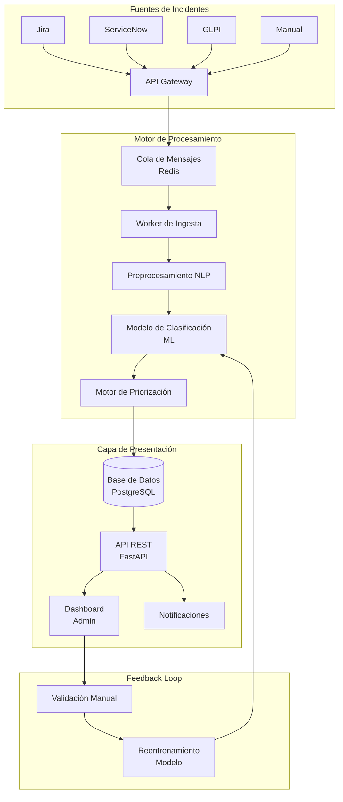
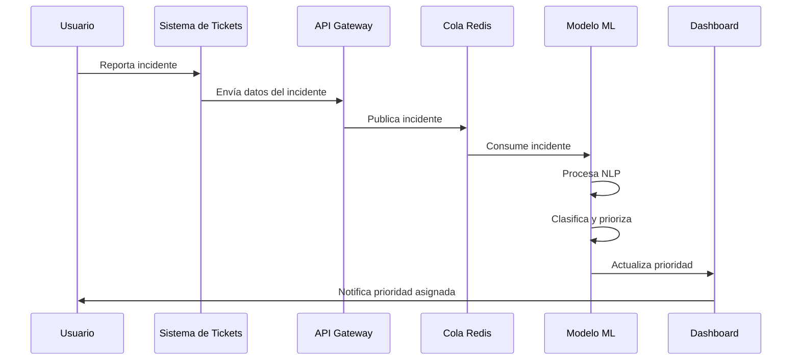

# Plan de Proyecto: Sistema Inteligente de Priorización de Incidentes IT con Inteligencia Artificial

**Versión:** 2.0  
**Fecha:** 18 de Febrero de 2026  
**Equipo:** 4 personas  
**Duración:** 2 meses y medio (10 semanas)  
**Tipo de documento:** Propuesta Técnica y Plan de Ejecución

---

## 1. Resumen Ejecutivo

Este documento presenta el plan de trabajo para el desarrollo de un sistema inteligente de priorización de incidentes de TI utilizando inteligencia artificial para clasificar y priorizar tickets automáticamente. El sistema analizará los incidentes reportados y asignará niveles de prioridad basándose en el contenido del ticket, historial de incidentes similares, y patrones de comportamiento.

El sistema propuesto combina múltiples componentes de inteligencia artificial y reglas de negocio:
- **LLM:** Comprensión del lenguaje natural del ticket
- **Embeddings:** Búsqueda semántica de incidentes similares
- **Motor de reglas:** Ajuste de prioridad basado en SLA y reglas empresariales
- **Métricas y explicabilidad:** Justificación de decisiones automáticas

Este enfoque híbrido permite un sistema competitivo y comercializable.

### Objetivos Principales

- Reducir el tiempo de respuesta ante incidentes críticos
- Optimizar la asignación de recursos técnicos
- Minimizar el impacto operativo mediante priorización predictiva
- Proporcionar métricas en tiempo real sobre la carga de trabajo

---

## 2. Tecnologías Recomendadas

### 2.1 Stack de Desarrollo

| Capa | Tecnología | Justificación |
|------|------------|---------------|
| **Backend** | Python 3.11+ | Ecosistema maduro para ML, bibliotecas especializadas |
| **Framework API** | FastAPI | Alto rendimiento, documentación automática, asincronía |
| **ORM** | SQLAlchemy 2.0 | Manejo de base de datos moderno |
| **ML/IA** | scikit-learn, TensorFlow/PyTorch | Modelos de clasificación probados |
| **NLP** | spaCy, transformers (BERT) | Procesamiento de lenguaje natural avanzado |
| **Base de datos** | PostgreSQL 15+ + pgvector | Almacenamiento de tickets y vectores de embeddings |
| **Cache/Cola** | Redis | Cache y procesamiento asíncrono |
| **Contenedores** | Docker + Docker Compose | Despliegue consistente |
| **Orchestración** | Kubernetes (opcional) | Escalabilidad futura |

### 2.2 Capa de Inteligencia Artificial

#### 2.2.1 Embeddings

Opciones recomendadas:
- **SentenceTransformers (all-MiniLM-L6-v2)** - Recomendado para inicio
- **BGE Embeddings** - Opción de alto rendimiento
- **OpenAI Embeddings** - Comercial opcional

Recomendación académica: SentenceTransformers + pgvector

#### 2.2.2 LLM (Large Language Model)

Opciones:
- **APIs comerciales:** OpenAI (GPT-4), Anthropic (Claude)
- **Modelos Open Source:** Llama 3, Mistral

Recomendación: Usar API externa inicialmente con arquitectura desacoplada para poder cambiar después.

### 2.3 Integraciones con Sistemas de Tickets Existentes

| Sistema | Tipo de Integración | Protocolo |
|---------|---------------------|-----------|
| **Jira Service Management** | API REST | HTTP/HTTPS |
| **ServiceNow** | API REST | HTTP/HTTPS |
| **GLPI** | API REST | HTTP/HTTPS |
| **Zendesk** | API REST | HTTP/HTTPS |
| **Freshservice** | API REST | HTTP/HTTPS |
| **PagerDuty** | API REST | HTTP/HTTPS |

### 2.4 Herramientas de Desarrollo

- **Control de versiones:** Git (GitHub/GitLab)
- **Gestión de proyectos:** Jira, Trello o Azure DevOps
- **Documentación:** Confluence o Notion
- **CI/CD:** GitHub Actions o GitLab CI
- **Monitoreo:** Prometheus + Grafana
- **Logging:** ELK Stack (Elasticsearch, Logstash, Kibana)

---

## 3. Arquitectura de la Solución

### 3.1 Arquitectura de Microservicios

```
API Gateway
|
---------------------------------
| Auth Service                  |
| Incident Service              |
| AI Prioritization Service     |
| Similarity Engine             |
| SLA Engine                   |
| Notification Service         |
---------------------------------
```

#### 3.1.1 AI Prioritization Service
- Generación de embeddings
- Búsqueda de similares
- Llamado al LLM
- Generación de explicación

#### 3.1.2 Similarity Engine
- Consulta en pgvector
- Retorno de top 5 incidentes similares
- Ajuste probabilístico de prioridad

#### 3.1.3 SLA Engine
- Reglas determinísticas
- Ajuste por criticidad del sistema
- Ajuste por tipo de cliente

### 3.2 Diagrama de Arquitectura General



### 3.3 Componentes Principales

#### A. Módulo de Ingesta de Incidentes

- Recibe incidentes de múltiples fuentes
- Normaliza formatos de datos
- Valida integridad de la información
- Publica en cola de procesamiento

#### B. Motor de Procesamiento NLP

- Tokenización y limpieza de texto
- Extracción de entidades relevantes
- Análisis de sentimiento
- Generación de embeddings semánticos

#### C. Modelo de Clasificación

- Clasificación por categoría de incidente
- Predicción de prioridad (Crítica/Alta/Media/Baja)
- Estimación de tiempo de resolución
- Detección de incidentes duplicados

#### D. Motor de Priorización

- Algoritmo de scoring multidimensional
- Considera: urgencia, impacto, recursos disponibles, SLA
- Rebalanceo dinámico de prioridades

#### E. Capa de API y Dashboard

- Endpoints REST para consulta
- Interfaz de administración
- Métricas y analytics
- Configuración de reglas de negocio

### 3.4 Flujo de Datos



---

## 4. Enfoque de Implementación: Sistema de Tickets

El sistema de priorización de IA puede implementarse de dos formas diferentes, dependiendo de las necesidades y recursos disponibles:

### 4.1 Opción A: Sistema de Tickets Desde Cero

Esta opción implica desarrollar un sistema completo de gestión de incidentes junto con el módulo de IA.

#### Ventajas
- Control total sobre la arquitectura
- Flexibilidad para personalizar funcionalidades
- Sin dependencias de sistemas externos
- Posible diferenciador comercial (SaaS)

#### Desventajas
- Mayor tiempo de desarrollo
- Mayor complejidad
- Requiere desarrollar todas las funcionalidades de gestión de tickets

#### Stack Recomendado para el Sistema de Tickets

| Componente | Tecnología |
|------------|------------|
| Frontend | React + Next.js o Flutter Web |
| Backend | FastAPI + Python |
| Base de datos | PostgreSQL |
| Autenticación | JWT |
| Notificaciones | Email, Slack, Teams |

#### Funcionalidades Mínimas Requeridas

1. **Gestión de Incidentes**
   - Creación de tickets con título, descripción, categoría
   - Asignación automática y manual
   - Estados: Abierto, En Proceso, Resuelto, Cerrado
   - Comentarios y actualizaciones

2. **Gestión de Usuarios**
   - Roles: Usuario, Técnico, Administrador
   - Autenticación y autorización
   - Perfiles de usuario

3. **Dashboard**
   - Métricas en tiempo real
   - Visualización de prioridades
   - Reportes y exportaciones

#### Cronograma Estimado (Adicional)

| Fase | Duración | Entregables |
|------|----------|-------------|
| Desarrollo UI/UX | 3 semanas | Interfaz de usuario funcional |
| Desarrollo Backend Tickets | 4 semanas | API completa de gestión |
| Integración con IA | 2 semanas | Sistema integrado |
| Pruebas y部署 | 2 semanas | Sistema en producción |

**Total adicional: ~11 semanas**

### 4.2 Opción B: Integración con Sistema Existente

Esta opción consiste en desarrollar únicamente el módulo de IA que se integra con sistemas de tickets ya existentes.

#### Ventajas
- Menor tiempo de desarrollo
- Utiliza infraestructura existente
- Implementación más rápida
- Menor riesgo

#### Desventajas
- Dependencia del sistema externo
- Limitaciones en personalización
- Requiere acceso a APIs del sistema

#### Sistemas Soportados para Integración

| Sistema | Complejidad | API Disponible | Notas |
|---------|-------------|-----------------|-------|
| **Jira Service Management** | Media | REST API | Muy utilizado en empresas |
| **ServiceNow** | Alta | REST API | Enterprise, ampliamente usado |
| **GLPI** | Baja | REST API | Open source, fácil integración |
| **Zendesk** | Media | REST API | Enfoque en soporte |
| **Freshservice** | Media | REST API | SaaS, fácil de usar |
| **Freshdesk** | Baja | REST API | Alternativa económica |

#### Implementación de la Integración

1. **Connector Genérico**
   - Adaptador abstracto para múltiples sistemas
   - Normalización de datos entrantes
   - Mapeo de campos específicos

2. **Sincronización**
   - Webhooks para eventos en tiempo real
   - Polling como respaldo
   - Manejo de errores y reintentos

3. **Callbacks**
   - Actualización de prioridad en el sistema origen
   - Notificaciones al usuario
   - Logging de decisiones

#### Comparación de Opciones

| Aspecto | Desde Cero | Integración Existente |
|---------|------------|------------------------|
| Tiempo total | ~21 semanas | ~10 semanas |
| Costo inicial | Alto | Medio |
| Control | Total | Limitado |
| Comercializable | Sí | Depende |
| Complejidad | Alta | Media |
| Mantenimiento | Alto | Medio |

---

## 5. Datasets Públicos Disponibles

A continuación se presentan datasets públicos que pueden utilizarse para el desarrollo y entrenamiento del sistema de clasificación de incidentes IT:

### 5.1 Datasets de Incidentes y Tickets de Soporte

| Dataset | Descripción | Enlace | Tamaño | Uso Recomendado |
|---------|-------------|--------|--------|-----------------|
| **ITIL Incident Logs** | Logs de incidentes ITIL con categorías y prioridades | UCI KDD Archive | ~100K registros | Clasificación de prioridades |
| **HDFS Dataset** | Logs de sistema distribuido con etiquetas de anomalías | Hadoop Wiki | ~11M registros | Detección de incidentes críticos |
| **Spambase** | Dataset de clasificación de spam (adaptable) | UCI ML Repository | ~4,600 registros | Pruebas de clasificación binaria |
| **Twitter Sentiment Analysis** | Tweets con etiquetas de sentimiento | Kaggle | ~1.6M tweets | NLP y análisis de texto |
| **Amazon Fine Food Reviews** | Reseñas con calificaciones | Kaggle | ~500K reseñas | Entrenamiento de modelos NLP |
| **Google Quest Q&A** | Preguntas y respuestas etiquetadas | Kaggle | ~15K pares | Clasificación de texto |

### 5.2 Datasets en Español para NLP

| Dataset | Descripción | Enlace | Idioma | Uso Recomendado |
|---------|-------------|--------|--------|-----------------|
| **Spanish Billion Words** | Corpus grande de texto en español | Múltiples fuentes | Español | Entrenamiento de embeddings |
| **XNLI (Spanish subset)** | Inferencia de lenguaje natural multilingüe | Hugging Face | Español | Clasificación de texto |
| **MASSIVE** | Intenciones multilingües (incluye español) | Hugging Face | 50+ idiomas | Clasificación de intenciones |
| **ES-STOP** | Palabras vacías en español | GitHub | ~500 palabras | Preprocesamiento NLP |
| **BETO** | Modelo BERT en español | Hugging Face | - | Fine-tuning para clasificación |
| **RoBERTa-BNE** | Modelo RoBERTa entrenado con datos españoles | Hugging Face | - | Clasificación en español |

### 5.3 Datasets de Tickets de Soporte Técnico

| Dataset | Descripción | Enlace | Formato |
|---------|-------------|--------|---------|
| **Support Tickets Classification** | Tickets de soporte con categorías | Kaggle | CSV |
| **Customer Support Tickets** | Dataset de tickets de clientes | Data.World | CSV |
| **IT Helpdesk Ticket Data** | Datos de helpdesk empresarial | GitHub | JSON/CSV |
| **Web Server Log Dataset** | Logs de servidor web | NASA HTTP | Log |

### 5.4 Recursos Adicionales para Generación de Datos

| Recurso | Descripción | Enlace |
|---------|-------------|--------|
| **Mockaroo** | Generación de datos sintéticos | mockaroo.com |
| **Faker** | Biblioteca Python para generar datos ficticios | GitHub |
| **SDV** | Synthetic Data Vault - generación de datos tabulares | sdv.dev |

### 5.5 Recomendaciones para Obtención de Datos

1. **Datos propios:** Solicitar acceso al sistema de tickets actual (Jira, GLPI, etc.) para extraer datos históricos
2. **Datos sintéticos:** Utilizar herramientas como Faker para generar datos de entrenamiento iniciales
3. **Transfer learning:** Usar modelos pre-entrenados en español (BETO, RoBERTa-BNE) para compensar falta de datos
4. **Data augmentation:** Aplicar técnicas de aumento de datos como back-translation para expandir el dataset

---

## 6. Diferenciadores Comerciales

El sistema incluye características diferenciadoras que lo hacen competitivo en el mercado:

### 6.1 Explicabilidad

El sistema proporciona explicaciones claras de por qué se asignó una prioridad específica.

**Ejemplo de salida:**
```
Se asignó prioridad P1 porque:
- El incidente es similar a 4 casos previos críticos
- Afecta el módulo de facturación
- Patrón de escalamiento detectado en 85% de casos similares
```

### 6.2 Predicción de Escalamiento

El sistema detecta patrones históricos y recomienda escalar incidentes de forma preventiva antes de que empeoren.

### 6.3 Score de Confianza

Cada predicción incluye un porcentaje de confianza para que los operadores puedan validar.

**Ejemplo de salida:**
```
Prioridad sugerida: P2
Confianza: 87%
Factores: Similaridad (92%), Reglas SLA (78%), Historial (85%)
```

---

## 7. Plan de Implementación

### 7.1 Fases del Proyecto

| Fase | Duración | Entregables |
|------|----------|-------------|
| **Fase 1: Fundamentos** | 2 semanas | Arquitectura definida, entorno configurado, baseline de datos |
| **Fase 2: Desarrollo Core** | 3 semanas | API base, pipeline de datos, modelo v1 |
| **Fase 3: Integración ML** | 2.5 semanas | Modelo de clasificación, NLP, pruebas A/B |
| **Fase 4: Despliegue** | 1.5 semanas | Contenedores, CI/CD, monitoreo |
| **Fase 5: Optimización** | 1 semana | Ajuste de hiperparámetros, documentación |

### 7.2 Milestones

- **Semana 2:** Pipeline de datos funcional con datos de prueba
- **Semana 5:** API REST con endpoints básicos operativos
- **Semana 7.5:** Modelo ML v1 con precisión >80%
- **Semana 9:** Integración completa con sistema de tickets
- **Semana 10:** Despliegue en producción y handover

---

## 8. División de Tareas por Perfil

### 8.1 Estructura del Equipo

Para un equipo de 4 personas, se recomienda la siguiente distribución:

| Rol | Cantidad | Responsabilidad Principal |
|-----|----------|---------------------------|
| **Tech Lead / ML Engineer** | 1 | Arquitectura, modelo ML, calidad de código |
| **Backend Developer** | 2 | API, integraciones, base de datos |
| **DevOps / Data Engineer** | 1 | Infraestructura, pipelines, monitoreo |

### 8.2 Asignación Detallada de Tareas

#### Tech Lead / ML Engineer (1 persona)

- Diseño de arquitectura del sistema
- Desarrollo del modelo de machine learning
- Implementación de pipeline de NLP
- Revisión de código y estándares
- Coordinación con stakeholders
- Validación de métricas de rendimiento del modelo

**Dependencias:** Coordina con todos los miembros del equipo

#### Backend Developer 1 (1 persona)

- Desarrollo de API REST con FastAPI
- Integración con sistemas de tickets (2 integraciones)
- Lógica de negocio para priorización
- Unit tests y documentación de API

**Dependencias:** Necesita definición de esquemas de datos del Tech Lead

#### Backend Developer 2 (1 persona)

- Desarrollo de modelos de datos en PostgreSQL
- Implementación de cola de mensajes Redis
- APIs de consumo para dashboard
- Optimización de consultas

**Dependencias:** Requiere diseño de base de datos del Tech Lead

#### DevOps / Data Engineer (1 persona)

- Configuración de Docker y Docker Compose
- Pipelines de CI/CD
- Infraestructura como código
- Scripts de migración de datos
- Configuración de monitoreo y logging
- Preparación de datasets para entrenamiento

**Dependencias:** Necesita artefactos de todos los desarrolladores

### 8.3 Matriz de Responsabilidades (RACI)

| Tarea | Tech Lead | Dev 1 | Dev 2 | DevOps |
|-------|-----------|-------|-------|--------|
| Diseño arquitectura | A | C | C | C |
| Modelo ML | R | - | - | C |
| API REST | A | R | C | - |
| Base de datos | C | - | R | A |
| Integraciones tickets | C | R | C | - |
| Pipeline datos | A | C | - | R |
| Infraestructura | C | - | - | R |
| Documentación | A | R | R | R |

**Leyenda:** R=Responsable, A=Aprobador, C=Consultado, I=Informado

---

## 9. Cronograma Semanal Detallado

### Semana 1-2: Fundamentos

| Semana | Actividad | Entregable |
|--------|-----------|------------|
| 1 | Reuniones de kickoff, análisis de requisitos | Documento de requisitos v1 |
| 1 | Análisis de datos históricos disponibles | Inventario de datos |
| 1 | Exploración de datasets públicos identificados | Reporte de datasets disponibles |
| 2 | Diseño de arquitectura técnica | Diagrama de arquitectura |
| 2 | Configuración de entorno de desarrollo | Repositorio configurado |
| 2 | Definición de esquemas de base de datos | Esquemas DB v1 |

### Semana 3-5: Desarrollo Core

| Semana | Actividad | Entregable |
|--------|-----------|------------|
| 3 | Desarrollo API base FastAPI | Endpoints CRUD básicos |
| 3 | Configuración PostgreSQL | Base de datos operativa |
| 3 | Implementación Redis | Cola de mensajes funcional |
| 4 | Desarrollo pipeline de ingestión | Pipeline de datos v1 |
| 4 | Integración sistema de tickets #1 | Connector Jira/SNOW |
| 5 | Integración sistema de tickets #2 | Connector adicional |
| 5 | Pruebas de integración | Pruebas funcionales |

### Semana 6-8: Integración ML

| Semana | Actividad | Entregable |
|--------|-----------|------------|
| 6 | Preprocesamiento NLP | Pipeline NLP v1 |
| 6 | Entrenamiento modelo baseline | Modelo v0.5 |
| 7 | Desarrollo modelo clasificación | Modelo v1.0 |
| 7 | Implementación motor de priorización | Motor de scoring |
| 8 | Pruebas A/B | Resultados de pruebas |
| 8 | Ajuste de hiperparámetros | Modelo optimizado |

### Semana 9-10: Despliegue y Cierre

| Semana | Actividad | Entregable |
|--------|-----------|------------|
| 9 | Dockerización de servicios | Contenedores listos |
| 9 | Configuración CI/CD | Pipeline CI/CD |
| 9 | Configuración monitoreo | Dashboard Grafana |
| 10 | Despliegue a producción | Sistema en vivo |
| 10 | Documentación técnica | Docs completas |
| 10 | Transferencia y handover | Presentación final |

---

## 10. Requisitos de Datos

### 10.1 Datos Necesarios para Entrenamiento

Para entrenar el modelo de clasificación se requiere acceso a:

- Historial de incidentes resueltos (mínimo 6 meses)
- Campos: título, descripción, categoría, prioridad asignada, tiempo de resolución, usuario reportante
- Clasificación manual de al menos 500 incidentes para validación

### 10.2 Datos a Recolectar en Producción

- Tiempos de primera respuesta
- Tiempos de resolución
- Satisfacción del usuario
- Cargas de trabajo por técnico
- Incidentes relacionados

---

## 11. Métricas de Éxito

### 11.1 Métricas Técnicas

| Métrica | Objetivo |
|---------|----------|
| Precisión del modelo | >85% |
| Recall para incidentes críticos | >95% |
| Latencia de clasificación | <2 segundos |
| Uptime del sistema | >99.5% |
| Cobertura de tests | >80% |

### 11.2 Métricas de Negocio

| Métrica | Objetivo |
|---------|----------|
| Reducción tiempo de triaje | >40% |
| Incidentes críticos atendidos antes | >30% |
| Satisfacción de usuarios | Mantener o mejorar |
| Reducción de SLA breaches | >25% |

### 11.3 Métricas de Observabilidad

- Tiempo de inferencia
- Exactitud de clasificación
- Reasignaciones humanas
- Score de confianza promedio

---

## 12. Riesgos y Mitigaciones

| Riesgo | Probabilidad | Impacto | Mitigación |
|--------|--------------|---------|------------|
| Datos insuficientes para entrenamiento | Alta | Alto | Generar datos sintéticos, usar transfer learning |
| Integración con sistemas legacy | Media | Alto | Diseñar adaptadores genéricos, fases de prueba |
| Resistencia al cambio del equipo | Media | Medio | Involucrar pronto, demostrar beneficios |
| Retrasos en infraestructura | Baja | Medio | Entorno local primero, infraestructura como código |
| Modelos con bias | Media | Alto | Auditorías periódicas, conjuntos de datos balanceados |

---

## 13. Recomendaciones Estratégicas

### 13.1 Evitar

- Entrenar modelos desde cero
- Infraestructura excesivamente compleja desde el inicio
- Interfaces innecesariamente complejas

### 13.2 Priorizar

- Arquitectura modular
- Métricas desde el inicio
- Dataset realista
- Demo comercial funcional

---

## 14. Modelo Comercial (Opcional)

Si se decide comercializarel sistema como SaaS:

| Plan | Características |
|------|-----------------|
| **Básico** | Clasificación automática de prioridades |
| **Pro** | Embeddings + análisis histórico |
| **Enterprise** | Integraciones avanzadas, customizaciones |

---

## 15. Nivel de Madurez Esperado en 2.5 Meses

- MVP funcional
- Arquitectura escalable
- Documento técnico formal
- Métricas cuantificables
- Demo lista para presentación

---

## 16. Próximos Pasos

1. Validar este plan con los stakeholders
2. Confirmar acceso a datos históricos de incidentes
3. Definir si se usará sistema desde cero o integración existente
4. Explorar y descargar datasets públicos identificados
5. Definir sistema de tickets primario para primera integración
6. Asignar recursos y comenzar configuración de entorno
7. Schedule de reuniones semanales de seguimiento

---

## 17. Consideraciones Adicionales

### 17.1 Escalabilidad Futura

El diseño permite escalar horizontalmente agregando más workers de procesamiento. La arquitectura basada en mensajes facilita la adación de nuevos modelos sin impacto en el sistema existente.

### 17.2 Seguridad

- Autenticación JWT
- Control de acceso basado en roles (RBAC)
- Logs de auditoría
- Encriptación HTTPS
- Rate limiting

### 17.3 Mantenimiento

- Reentrenamiento mensual del modelo con datos actualizados
- Revisión trimestral de reglas de negocio
- Actualización de dependencias trimestral

### 17.4 Infraestructura

- Docker + Docker Compose
- Nginx
- Certbot (HTTPS)
- VPS (AWS, GCP o DigitalOcean)
- Opcional avanzado: Kubernetes

---

**Documento preparado para revisión y aprobación**

*Este plan sirve como guía inicial y debe adaptarse según retroalimentación del equipo y stakeholders.*
